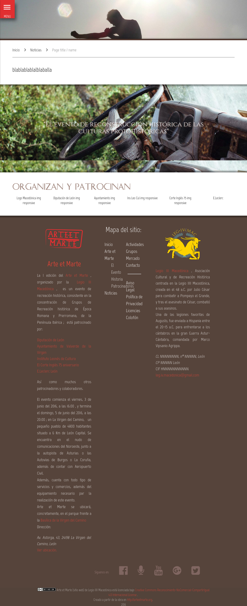

General layout for the website arteetmarte.org
==============================================

General layout for the website arteetmarte.org

We use the next elements and components:

- Materialize
- jQuery
- FontAwesome
- Google Fonts
- Material Design Icons

We use Bower as the front-end package manager (we use Bower to download the assets and plugins), and Gulp to compile,
concatenate and minify them.

- Materialize
- jQuery
- FontAwesome
- Google Fonts
- Material Design Icons

## Gulp use:

Simple, use gulp, after npm and all dependencies are installed.

## Previews:

